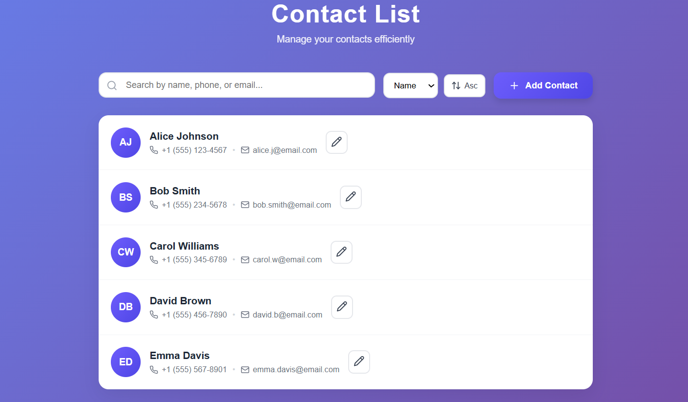

# 📇 Contact List App

A modern, intuitive contact management application built with **React** that helps you organize and manage your contacts efficiently.

---

## 🚀 Live Demo
👉 [Contact List App](https://contact-list-ten-eta.vercel.app/)

---

## ✨ Features

- **Add Contacts:** Easily add new contacts with name, phone number, and email  
- **View Contacts:** Browse through your contact list with a clean, organized interface  
- **Edit Contacts:** Update contact information whenever needed  
- **Delete Contacts:** Remove contacts that are no longer needed  
- **Search Functionality:** Quickly find contacts by searching through your list  
- **Responsive Design:** Works seamlessly across desktop, tablet, and mobile devices  
- **Local Storage:** Your contacts are saved locally in your browser  

---

## 🛠️ Technologies Used

- ⚛️ **React.js** — Frontend library for building the UI  
- 🎨 **CSS3** — For styling and responsive design  
- 💾 **Local Storage API** — For persisting contact data  
- ☁️ **Vercel** — For deployment and hosting  

---

## 📋 Prerequisites

Before you begin, ensure you have the following installed:

- **Node.js** (v14.0.0 or higher)  
- **npm** (v6.0.0 or higher)

---

## 🔧 Installation

### 1. Clone the repository
```bash
git clone https://github.com/saikiran9346/ContactList.git
````

### 2. Navigate to the project directory

```bash
cd ContactList
```

### 3. Install dependencies

```bash
npm install
```

### 4. Start the development server

```bash
npm start
```

Then open your browser and visit 👉 **[http://localhost:3000](http://localhost:3000)**

---

## 📦 Build for Production

To create a production build:

```bash
npm run build
```

This will create an optimized build in the **build** folder.

---

## 🎯 Usage

* **Adding a Contact:** Click on the “Add Contact” button, fill in the contact details, and save
* **Viewing Contacts:** All your contacts are displayed on the main screen
* **Editing a Contact:** Click the edit icon next to a contact, modify details, and save
* **Deleting a Contact:** Click the delete icon to remove a contact
* **Searching:** Use the search bar to filter contacts by name, phone, or email

---
## 🖼️ App Preview




## 📁 Project Structure

```
ContactList/
├── public/
│   ├── index.html
│   └── ...
├── src/
│   ├── components/
│   │   ├── AddContactForm.jsx
│   │   ├── ContactCard.jsx
│   │   ├── ContactList.jsx
│   │   ├── EmptyState.jsx
│   │   └── SearchBard.jsx
│   │   └── SortControls.jsx
│   ├── hooks/
│   │   ├── useLocalStorage.js
│   ├── App.js
│   ├── App.css
│   ├── index.js
│   ├── index.css
│   ├── reportWebVitals.js
├── package.json
└── README.md
```

---

## 📝 Future Enhancements

* 📂 Add contact categorization (Family, Friends, Work, etc.)
* 📤 Import/Export contacts as CSV or vCard
* 🖼️ Add profile pictures for contacts
* 👥 Implement contact groups
* 🌙 Add dark mode theme
* 🔍 Advanced search filters

---

## 👤 Author

**Sai Kiran**
GitHub: [@saikiran9346](https://github.com/saikiran9346)

---

## 📄 License

This project is open source and available under the **MIT License**.

---

## 🙏 Acknowledgments

* React documentation and community
* All contributors who helped improve this project

---

## 📞 Support

If you have any questions or run into issues, please open an issue on the [GitHub repository](https://github.com/saikiran9346/ContactList).

⭐ **If you find this project useful, please give it a star on GitHub!**

```
```
